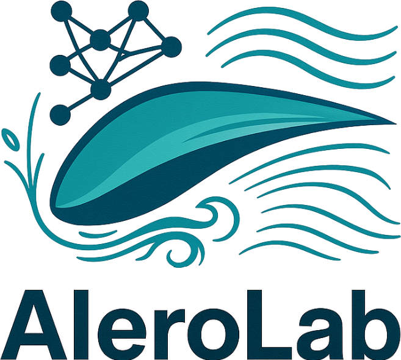

    
    <h3>Optimising the aerodynamics of an airfoil using Machine Learning</h3>

Three parts are attached to this project :

- A [Physics-Informed Neural Network (PINN)](./1-pinn) to calculate the flow around an airfoil, and optimize its geometry to maximise its performances
- [3D printing of wing profiles](./2-wing-printing) which performances are characterized using physical experiments
- [An analysis of the previous experiments](./3-analysis) to verify predictions and automatically characterize the flow and exerted forces

For more details, see the [full report](https://typst.app/project/rSK0y9y5d9yZI8AktfFKCW).

# 📜 Credits

- Work done by Théo Vidal at the _Unité de Mécanique (UME)_ of [ENSTA](https://www.ensta-paris.fr/en/node)
- Project logo generated by ChatGPT 4o
- All other references are in the Bibliography section of the [project report](https://typst.app/project/rSK0y9y5d9yZI8AktfFKCW)
